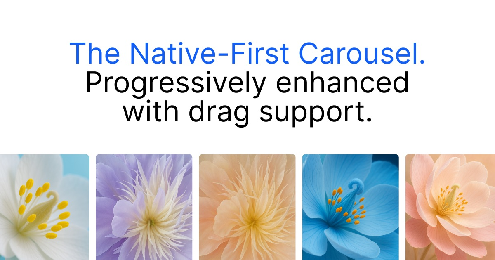

# Blossom Carousel

<p>
<a href="https://www.npmjs.com/package/@blossom-carousel/core"></a>
<a href="https://bundlephobia.com/package/@blossom-carousel/core"></a>
</p>

The native-first carousel enhanced with drag support.

➥ [www.blossom-carousel.com](http://www.blossom-carousel.com)

## Why Blossom?

<ul style="list-style: none; padding: 0;">
<li>🥇 <strong>Native scrolling</strong>: Full performance and accessibility.</li>
<li>🚀 <strong>Dragging</strong>: Custom physics-based dragging for all pointer types.</li>
<li>✨ <strong>No abstraction</strong>: use all native web API's.</li>
<li>💡 <strong>Configure with CSS</strong>: Works with native scroll-snap, position sticky and scroll-driven animations.</li>
<li>🪶 <strong>0kb on touch devices</strong>: Blossom only loads when a fine pointer device is detected.</li>
<li>🧱 <strong>Works with major frameworks</strong>: Components for React, Vue, Svelte and Web Components.</li>
</ul>

## Installation

### React

[React Docs](./packages/react)

```bash
npm install @blossom-carousel/react
```

### Vue

[Vue Docs](./packages/vue)

```bash
npm install @blossom-carousel/vue
```

### Svelte

[Svelte Docs](./packages/svelte)

```bash
npm install @blossom-carousel/svelte
```

### Web Component

[Web Component Docs](./packages/web)

```bash
npm install @blossom-carousel/web
```

### Core

[Core Docs](./packages/core)

```bash
npm install @blossom-carousel/core
```

## Examples

- [Simple](https://www.blossom-carousel.com/docs/examples#simple)
- [Variable widths](https://www.blossom-carousel.com/docs/examples#variable-widths)
- [CSS Grid](https://www.blossom-carousel.com/docs/examples#css-grid)
- [Multiple rows](https://www.blossom-carousel.com/docs/examples#multiple-rows)
- [Snapping](https://www.blossom-carousel.com/docs/examples#snapping)
- [Grouping](https://www.blossom-carousel.com/docs/examples#grouping)
- [Sticky](https://www.blossom-carousel.com/docs/examples#sticky)
- [Coverflow](https://www.blossom-carousel.com/docs/examples#cover-flow)
- [Right to Left](https://blossom-carousel.com/docs/examples#right-to-left)
