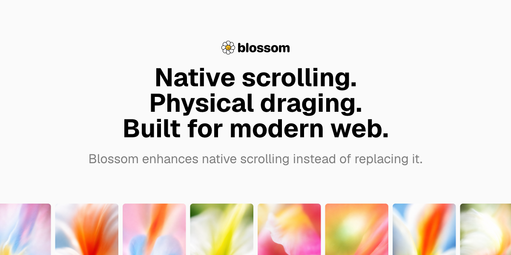

# Blossom Carousel

<p>
<a href="https://www.npmjs.com/package/@blossom-carousel/core"></a>
<a href="https://bundlephobia.com/package/@blossom-carousel/core"></a>
<a href="https://www.npmjs.com/package/@blossom-carousel/core"></a>
</p>

Blossom Carousel is the first carousel library that builds on native browser scrolling instead of replacing it. It provides a small drag enhancement for pointer devices while maintaining the core interaction model, performance, and accessibility of a real scroll container.

<ul style="list-style: none; padding: 0;">
<li>🥇 <strong>Native scrolling</strong>: Full performance and accessibility.</li>
<li>🚀 <strong>Dragging</strong>: Custom physics-based dragging for all pointer types.</li>
<li>➡️ <strong>Navigation controls</strong>: First-class Previous, Next and Dots navigation controls.</li>
<li>✨ <strong>No abstraction</strong>: Works with all native web API's.</li>
<li>💡 <strong>Configure with CSS</strong>: Works with CSS scroll-snap, position sticky and scroll-driven animations and more.</li>
<li>🪶 <strong>0kb on touch devices</strong>: Blossom only loads when a fine pointer device is detected.</li>
<li>🧱 <strong>Framework ready</strong>: Components for React, Vue, Svelte and Web Components.</li>
<li>🚧 <strong>Experimental cyclical scrolling</strong>: Allows the carousel to infinitely loop.</li>
</ul>

## Installation

| Framework     | Installation Command                   | Docs                                                                                        |
| ------------- | -------------------------------------- | ------------------------------------------------------------------------------------------- |
| Vue           | `npm install @blossom-carousel/vue`    | [Vue Docs](https://blossom-carousel.com/docs/framework-guides/vue-nuxt)                     |
| React         | `npm install @blossom-carousel/react`  | [React Docs](https://blossom-carousel.com/docs/framework-guides/react-nextjs)               |
| Svelte        | `npm install @blossom-carousel/svelte` | [Svelte Docs](https://blossom-carousel.com/docs/framework-guides/svelte-sveltekit)          |
| Web Component | `npm install @blossom-carousel/web`    | [Web Component Docs](https://www.blossom-carousel.com/docs/framework-guides/web-components) |
| Core          | `npm install @blossom-carousel/core`   | [Core Docs](https://www.blossom-carousel.com/docs/framework-guides/core)                    |

## Agent Skills

Blossom Carousel's Agent Skills help AI coding assistants give package-specific guidance.

Install the skills
Compatible agents (Cursor, Claude Code, etc.) can discover and use skills automatically.

```bash
npx skills add https://www.blossom-carousel.com
```

## Examples

Explore ready-to-copy carousel patterns grouped by complexity.

[See all examples](https://www.blossom-carousel.com/docs/examples/)

## Migration Guides

| From     | Migration Guide                                                                            |
| -------- | ------------------------------------------------------------------------------------------ |
| Embla    | [Migration from Embla](https://www.blossom-carousel.com/docs/migration-guides/embla)       |
| Swiper   | [Migration from Swiper](https://www.blossom-carousel.com/docs/migration-guides/swiper)     |
| Splide   | [Migration from Splide](https://www.blossom-carousel.com/docs/migration-guides/splide)     |
| Slick    | [Migration from Slick](https://www.blossom-carousel.com/docs/migration-guides/slick)       |
| Flickity | [Migration from Flickity](https://www.blossom-carousel.com/docs/migration-guides/flickity) |
